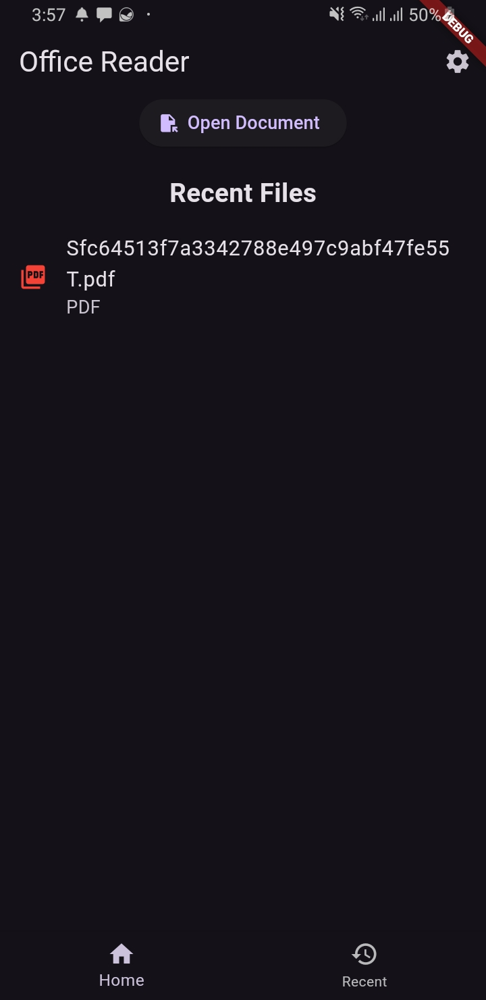
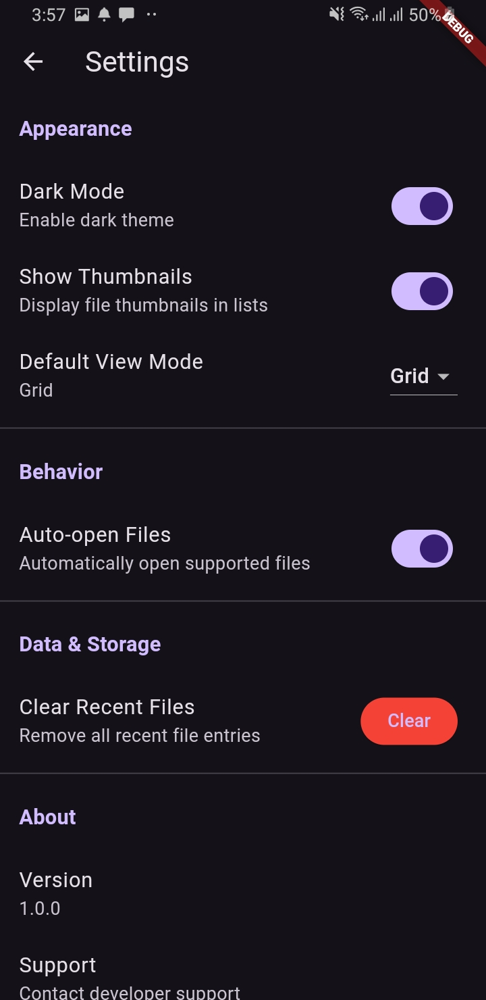

# Office Reader

A powerful Flutter-based document reader application for Android that allows users to open, view, and manage PDF, Word (DOCX), and Excel files with ease. The app provides a clean and intuitive interface for reading and analyzing office documents on the go.

## 📱 Features

- **PDF Viewer**: Open and view PDF files with smooth scrolling and zoom capabilities
- **Word Document Support**: Read DOCX files with full text formatting preservation
- **Excel Spreadsheet Viewer**: View Excel files with chart support using Syncfusion
- **File Picker**: Easy-to-use file picker to select documents from your device
- **Recent Files**: Quick access to your recently opened documents
- **File Management**: Organize and manage your documents efficiently
- **Document Conversion**: Support for multiple office document formats
- **Settings**: Customizable app settings for personalized experience
- **Permission Handling**: Proper Android permission management for file access
- **High Performance**: Uses optimized Syncfusion components for fast rendering

## 🎨 Screenshots

### Home Screen


### Document Viewer


## 🛠️ Tech Stack

- **Framework**: Flutter 3.38.5
- **Language**: Dart 3.10.4
- **State Management**: Provider
- **PDF Viewing**: Syncfusion Flutter PDFViewer
- **File Picking**: File Picker
- **Excel Support**: Syncfusion Flutter Charts & Excel
- **Document Support**: Syncfusion Office Chart, Docx Viewer
- **Storage**: Path Provider, Shared Preferences

## 📋 Prerequisites

Before you begin, ensure you have the following installed:

- **Flutter**: Version 3.38.5 or higher
- **Dart**: Version 3.10.4 or higher
- **Android SDK**: API level 21 or higher
- **Java Development Kit (JDK)**: Version 11 or higher
- **Git**: For cloning the repository

## 🚀 Getting Started

### 1. Clone the Repository

```bash
git clone https://github.com/yourusername/office_reader.git
cd office_reader
```

### 2. Install Dependencies

```bash
flutter pub get
```

### 3. Run the App

**On Android Device/Emulator**:
```bash
flutter run
```

**Build Debug APK**:
```bash
flutter build apk --debug
```

**Build Release APK**:
```bash
flutter build apk --release
```

## 📖 Usage Examples

### Opening a Document

1. Launch the Office Reader app
2. Tap the **"Pick File"** button on the home screen
3. Select a PDF, DOCX, or Excel file from your device
4. The document will open automatically in the viewer

### Viewing Recent Files

1. Navigate to the **Recent Files** screen from the home menu
2. Tap any file to open it again
3. Swipe or long-press options to manage your recent files

### Accessing Settings

1. Go to the **Settings** screen from the main menu
2. Customize your preferences (theme, display options, etc.)
3. Changes are saved automatically using Shared Preferences

### Managing Multiple Documents

- Open multiple documents in sequence
- Use the back button to return to the file picker
- Recently opened files are automatically saved for quick access

## 📁 Project Structure

```
office_reader/
├── lib/
│   ├── main.dart                 # Entry point
│   ├── models/                   # Data models
│   │   ├── document.dart
│   │   └── recent_document.dart
│   ├── providers/                # State management
│   │   ├── recent_documents_provider.dart
│   │   └── settings_provider.dart
│   ├── screens/                  # UI screens
│   │   ├── document_viewer_screen.dart
│   │   ├── home_screen.dart
│   │   ├── recent_files_screen.dart
│   │   └── settings_screen.dart
│   ├── utils/                    # Utilities
│   │   └── constants.dart
│   └── widgets/                  # Reusable widgets
│       ├── document_view.dart
│       ├── file_picker_button.dart
├── android/                      # Android native code
├── ios/                          # iOS native code
├── test/                         # Unit and widget tests
├── pubspec.yaml                  # Project dependencies
└── README.md                     # This file
```

## 🔒 Permissions

The app requires the following permissions:

- **READ_EXTERNAL_STORAGE**: To access documents on the device
- **WRITE_EXTERNAL_STORAGE**: To cache and manage files (Android 12 and below)
- **MANAGE_EXTERNAL_STORAGE**: For broad file access (Android 11+)

These permissions are handled automatically through the `permission_handler` package.

## 🐛 Troubleshooting

### Build Issues

If you encounter build errors:

```bash
# Clean build artifacts
flutter clean

# Get latest dependencies
flutter pub get

# Run pub upgrade for latest compatible versions
flutter pub upgrade
```

### Android Gradle Issues

If Android build fails:

```bash
# Clean Android build
cd android
./gradlew clean
cd ..

# Rebuild
flutter run
```

### File Permission Errors

Ensure permissions are granted:
- Go to Settings > Apps > Office Reader > Permissions
- Enable "Files and Media" access

## 📦 Dependencies

Key dependencies used in this project:

```yaml
flutter:
  sdk: flutter

syncfusion_flutter_pdfviewer: ^29.2.11
file_picker: ^10.3.10
path_provider: ^2.1.1
open_file: ^3.3.2
permission_handler: ^11.0.1
syncfusion_flutter_charts: ^29.2.11
intl: ^0.18.1
shared_preferences: ^2.4.0
provider: ^6.1.2
excel: ^4.0.6
syncfusion_officechart: ^29.2.11
docx_viewer: ^0.2.1
syncfusion_flutter_core: ^29.2.11
docx_template: ^0.4.0
```

## 🤝 Contributing

Contributions are welcome! To contribute:

1. Fork the repository
2. Create a feature branch (`git checkout -b feature/amazing-feature`)
3. Commit your changes (`git commit -m 'Add amazing feature'`)
4. Push to the branch (`git push origin feature/amazing-feature`)
5. Open a Pull Request

## 📄 License

This project is licensed under the MIT License - see the LICENSE file for details.

## 👨‍💻 Author

**Your Name/Organization**
- GitHub: [@yourusername](https://github.com/yourusername)
- Email: your.email@example.com

## 🙏 Acknowledgments

- [Syncfusion Flutter Widgets](https://www.syncfusion.com/flutter-widgets) for excellent document viewing components
- [Flutter Documentation](https://flutter.dev/) for comprehensive guides
- All contributors and community members who have helped improve this project

## 📞 Support

For issues, questions, or suggestions:

- Open an [GitHub Issue](https://github.com/yourusername/office_reader/issues)
- Check existing documentation and FAQs
- Contact via email for urgent matters

## 🔄 Changelog

### Version 1.0.0 (Initial Release)
- PDF document viewing
- DOCX file support
- Excel spreadsheet viewer
- Recent files feature
- Settings screen
- File picker integration
- Permission handling
